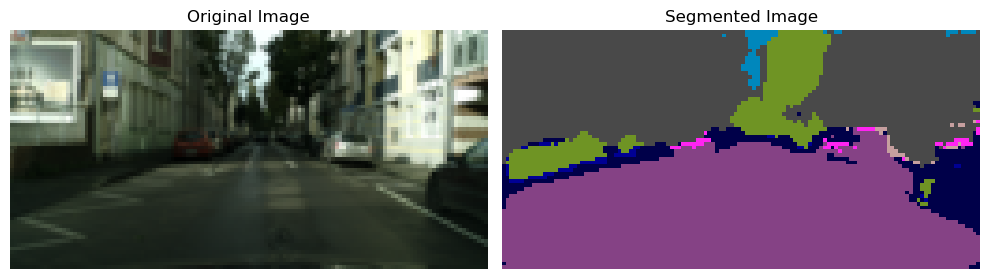
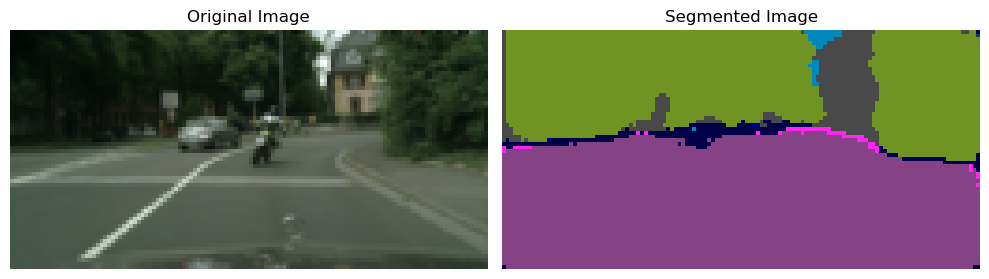
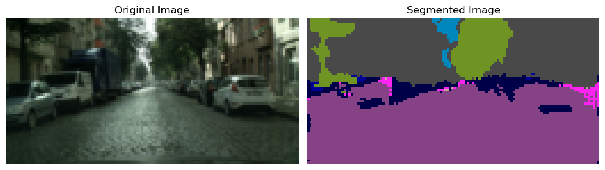
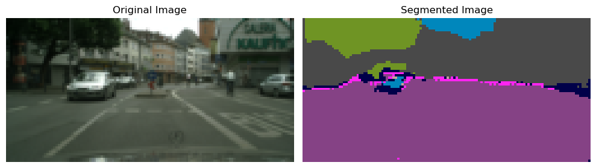
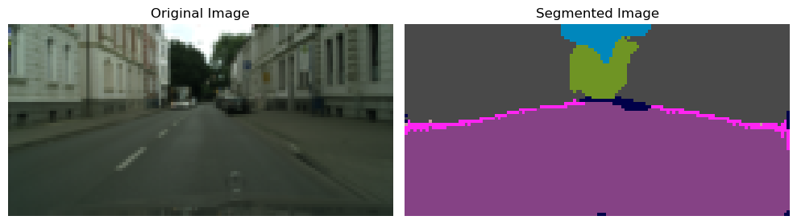

# HW 1 - Cityscapes Segmentation

## Task

Решаю задачу semantic segmentation. Цель - самостоятельно имплементировать архитектуру U-Net (конечно с меньшим количеством параметров,mac чтобы обучить это средствами Google Colab за адекватное время).

В качестве датасета - возьму Cityscapes. Описание:
> Cityscapes is a large-scale database which focuses on semantic understanding of urban street scenes. It provides semantic, instance-wise, and dense pixel annotations for 30 classes grouped into 8 categories (flat surfaces, humans, vehicles, constructions, objects, nature, sky, and void). The dataset consists of around 5000 fine annotated images and 20000 coarse annotated ones. Data was captured in 50 cities during several months, daytimes, and good weather conditions. It was originally recorded as video so the frames were manually selected to have the following features: large number of dynamic objects, varying scene layout, and varying background.

Датасет буду использовать не весь, а только некоторую часть.

## Dataset

[Cityscapes](https://www.cityscapes-dataset.com/)

Код для работы с датасетом (загрузка, визуализация данных): [data_handler.py](/src/cityscapes_data_handler.py).

Краткий анализ датасета был проведен в [eda.ipynb](/eda.ipynb).

Данные:

* train: 2915 images + labels
* val: 250 images + labels
* test: 250 images + labels

(Note: Because getting scores on the test split requires loading predictions on <https://www.cityscapes-dataset.com/> cite (and it has a large cooldown of 48h for 1 submit). So I will use part of the val dataset as the test set.)

Число классов было выбрано = 19 (виды классов есть [тут](/src/cityscapes_data_handler.py))

## Metrics calculation

Расчет метрик реализован в файле [metrics.py](/src/metrics.py).

Метрики:

* Precision - как по всем классам, так и усредненный по типу weighted, macro
* Recall - как по всем классам, так и усредненный по типу weighted, macro
* F1 score - как по всем классам, так и усредненный по типу macro
* Dice score - как по всем классам, так и усредненный по типу samples

Для реализации метрик использовалась библиотека `pytorch-ignite`.

## Logging

Логгирование выполнялось с помощью `wandb`.

## Train, val, test pipeline

Пайплайн обучения, валидации и тестирования находится в [model_pipeline.py](/src/trainer.py)

## U-Net

Реализовал классическую архитектуру U-Net ([ориг статья](https://arxiv.org/abs/1505.04597)). Реализация в [unet.py](/src/unet.py).

> Note: везде использую тип данных `bfloat16`.

Основной ноутбук с кодом: [unet.ipynb](/unet.ipynb).

Всего выполнил 3 эксперимента, в которых постепенно изменял архитектуру модели и конфигурацию тренировки. Все эксперименты описаны в соответствующих разделах в [unet.ipynb](/unet.ipynb).

### Experiment 1

#### Цель

Обучить модель с архитектурой U-Net и следующими параметрами:

* start_channels=8
* depth=2

Также будем использовать размер изобаржения = (64, 128).

Параметры обучения:

* Adam с learning_rate=1e-3
* epochs=5
* batch_size=64

#### Идея

Обучить достаточно малую модель на задачу semantic segmentation на датасете Cityscapes. Хочется увидеть рост метрик на основных классам сегментации (road, car, sidewalk, building, sky, terrain, person). Понятное дело, что на классах, которые встречаются мало и в целом занимают малую площадь на картинках (из-за того что я уменьшил размер картинки их плозадь еще меньше) метрики будут околонулевые.

#### Результаты

##### Графики лосс-функции при обучении (на тренировочном и валидационном датасете)

##### Аггрегированные (по всем классам) метрики на валидационной выборке

##### Метрики отдельных на валидационной выборке

Классы с наиболее высокими метриками

.png)

.png)

У остальных классов метрики либо нулевые, либо очень малы

.png)

##### Метрики на тестовом датасете

|               |   precision |   recall |       f1 |     dice |
|:--------------|------------:|---------:|---------:|---------:|
| aggregated    |    0.194871 | 0.203552 | 0.180893 | 0.180893 |
| road          |    0.774    | 0.995    | 0.871    | 0.871    |
| sky           |    0.767    | 0.888    | 0.823    | 0.823    |
| vegetation    |    0.836    | 0.808    | 0.822    | 0.822    |
| building      |    0.775    | 0.851    | 0.811    | 0.811    |
| sidewalk      |    0.22     | 0.031    | 0.055    | 0.055    |
| truck         |    0.018    | 0.283    | 0.033    | 0.033    |
| car           |    0.306    | 0.011    | 0.02     | 0.02     |
| fence         |    0.005    | 0.001    | 0.002    | 0.002    |
| pole          |    0.002    | 0        | 0        | 0        |
| traffic_light |    0        | 0        | 0        | 0        |
| wall          |    0        | 0        | 0        | 0        |
| terrain       |    0        | 0        | 0        | 0        |
| traffic_sign  |    0        | 0        | 0        | 0        |
| rider         |    0        | 0        | 0        | 0        |
| person        |    0        | 0        | 0        | 0        |
| bus           |    0        | 0        | 0        | 0        |
| train         |    0        | 0        | 0        | 0        |
| motorcycle    |    0        | 0        | 0        | 0        |
| unlabelled    |    0        | 0        | 0        | 0        |

##### Примеры сегментации

#### Выводы

сошлась ли сеть, стало ли генерироваться лучше, предположить почему, сравнить графики лоссов, генерируемые изображения

В данном эксперименте была взята малая модель (120k параметров), однако результаты показали, что архитектура UNet была реализована верно и метрики растут на классах, которые занимают большую площадь в среднем на обучающих изображениях.

А именно, метрики recall и precision больше `0.8` на таких классах как

* road
* sky
* vegetation
* building

Эти классы, очевидно, наиболее представлены в датасете, поэтому модель наиболее их и выучила.

Также стоит помнить, что в целях ускорения обучения, а также из-за отсутствия больших вычислительных ресурсов изображения были уменьшены с размера 2048х1024 до 64х128. И из-за этого находить объекты, которые занимали малую площадь на изображениях исходного размера стало ещё труднее на уменьшенных изображениях.

### Experiment 2

#### Цель

#### Идея

#### Результаты

#### Выводы

### Experiment 3

#### Цель

#### Идея

#### Результаты

#### Выводы

## Useful

<https://arxiv.org/abs/1505.04597>

<https://arxiv.org/abs/2302.06378>

<https://arxiv.org/pdf/2305.03273>

<https://paperswithcode.com/method/vision-transformer>

<https://habr.com/ru/articles/599057/>
