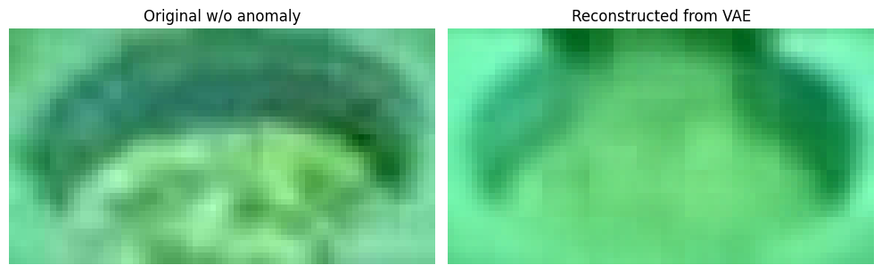

# HW 2 - Anomaly Detection

## Task

Имеются изображения технологического процесса разлива металлических цилиндров. Есть риск нарушения технологии: когда стенки цилиндра не успевают застывать и трескаются, незастывший металл выливается, не образуя требуемую заготовку. Необходимо оперативно определить лунку, где произошел пролив, при этом пролив - довольно редкое явление, гораздо больше изображений без пролива в лунке.

Задача: построить модель на основе автоэнкодера, определяющую состояние лунки:

* пролив
* не пролив

## Structure

```cmd
├── eda.ipynb
├── experiments.ipynb
├── README.md
└── src
    ├── big_conv_vae.py
    ├── data_processing.py
    ├── __init__.py
    ├── linear_vae.py
    ├── metrics.py
    ├── pipeline.py
    ├── small_conv_vae.py
    └── utils.py
```

## Dataset

Данные - вырезанные с фото изображения лунок.

[Ссылка на датасет](https://drive.google.com/file/d/1DHuQ3DBsgab6NtZIZfAKUHS2rW3-vmtb/view)


```cmd
data
├── proliv  # изображения с проливами
|       ├── 000.jpg
│       ├── 001.jpg
│       │   └── ...
|
├── test  # тестовая выборка где перемешаны проливы и не_проливы
│       ├── imgs
│       │   ├── 000.jpg
│       │   ├── 001.jpg
│       │   └── ...
│       └── test_annotation.txt
|
├── train  #  обучающая выборка из не_проливов
|       ├── 000.jpg
│       ├── 001.jpg
│       └── ...
```

### EDA

[EDA](./eda.ipynb) - минимальный EDA.

По итогам анализа датасета было выявлено, что размеры изображений не одинаковы. Поэтому все изображения были приведены к единому (наибольшему) размеру: `(40, 72)` с применением билинейной интерполяции.

[data_processing.py] - классы для данных в формате `torch.Dataset`, а также различные утилиты для данных.

## Metrics calculation

Расчет метрик реализован в файле [metrics.py](./src/metrics.py).

Метрики:

* True Positive Rate
* True Negative Rate

## Logging

Логгирование выполнялось с помощью `wandb`.

## Train, val, test pipeline

Пайплайн обучения, валидации, тестирования, а также функция потерь для VAE находится в [pipeline.py](/src/pipeline.py)

### Валидация

Был сформирован валидационный датасет, состоящий из `512` изображений без аномалий и `154` изображений с аномалиями. После каждой тренировочной эпохи этот датасет прогонялся через VAE и рассчитывался loss отдельно для аномальных и не аномальных изображений.

Затем используя два этих значения лосса на этих датасетах был расчитан порог, по которому будет проведена классификация изображений из тестового датасета.

Расчет порога:

$$ threshold = (proliv_mean_loss + not_proliv_mean_loss) / 2 $$

Для определения класса тестового изображения:

1. Изображение прогоняется через VAE и расчитывается loss
2. Полученный loss сравнивается с threshold
    1. $ loss > threshold $ -> изображение с аномалией
    2. иначе -> изображение без аномалии

### Функция потерь

В качестве функции потерь использую 2 части:

1. Потери реконструкции изображения (reconstruction loss) - MSE от пикселей исходного и сгенерированного изображений
2. KL-дивергенция между распределениями `p(z)` и `p(z|x)` (regularizatoin term)

## Variational autoencoder

В работе реализованы 3 вида `VAE` ([ориг статья](https://arxiv.org/pdf/1312.6114)):

1. [LinearVAE](./src/linear_vae.py) - вариационный автоэнкодер на полносвязных слоях
2. [SmallConvVAE](./src/small_conv_vae.py) - вариационный автоэнкодер на сверточных слоях (малое число параметров)
3. [BigConvVAE](./src/big_conv_vae.py) - вариационный автоэнкодер на сверточных слоях (большое число параметров)

Ход всех экспериментов находятся в основном ноутбуке: [experiments.ipynb](./experiments.ipynb). Все эксперименты описаны в соответствующих разделах ipynb.

### Experiments

|              | Model type    | Parameters #   |   Epochs |   Learning rate |
|:-------------|:--------------|:---------------|---------:|----------------:|
| Experiment 1 | Linear        | 90M            |      150 |          0.001  |
| Experiment 2 | Convolutional | 2.5M           |      200 |          0.0003 |
| Experiment 3 | Convolutional | 12M            |      100 |          0.0003 |

### Experiment 1 - Linear VAE

#### Цель

Обучить модель с архитектурой VAE на линейных слоях для анализа аномалий по изображениям.

Параметры обучения:

* Adam с learning_rate=1e-3
* epochs=150
* batch_size=512

#### Идея

Не смотря на то что мы анализируем изображения и для работы с ними требуется использовать компоненты которые учитывают пространственную связь пикселей, попробовать обучить VAE на линейных слоях.

Мое предположение в том, что так как у нас изображения довольно маленького размера `3x40x72`, то и FC-слои могут достаточно хорошо справиться с поставленной задачей (не будет сильного всплеска по числу параметров).

#### Результаты

##### График лосс-функции на тренировочном датасете при обучении


##### Графики лосс-функции на валидационном датасете с/без аномалий при обучении


##### Метрики на тестовом датасете

* TPR: 0.95
* TNR: 0.75

##### Примеры генерации из вектора шума


##### Примеры генерации из изображений без аномалий


##### Примеры генерации из изображений с аномалиями


#### Выводы

Не смотря на свою простоту, VAE на линейных слоях выдала достаточно неплохие метрики на тестовом датасете. По примерам сгенерированных изображений видно, что модель нашла некоторый `усредненный` вид всех изображений и генерирует почти только его, соответственно при дальнейшем сравнении с исходными изображениями она неплохо умеет отличать аномальные изображения из-за их довольно сильных визуальных различий.

### Experiment 2 - Small ConvVAE

#### Цель

Протестировать модель VAE на сверточных слоях. Для анализа изображений сверточные слои подходят намного лучше, чем полносвязные, так как это позволяет учитывать пространственный аспект данных, а также снизит потребление параметров в сети.

Изменения в сравнении с экспериментом №1:

* epochs: 150 -> 200

Размер изображения и размер батча остались те же.

#### Идея

Проанализировать эффективность применения сверточных слоев в нашей задаче.

#### Результаты

##### График лосс-функции на тренировочном датасете при обучении


##### Графики лосс-функции на валидационном датасете с/без аномалий при обучении


##### Метрики на тестовом датасете

* TPR: 0.82
* TNR: 0.84

##### Примеры генерации из вектора шума


##### Примеры генерации из изображений без аномалий


##### Примеры генерации из изображений с аномалиями


#### Выводы

Данная модель в среднем показала похожие метрики что и модель на линейных слоях. Однако теперь мы видим заметные изменения в результатах генерации изображений. Теперь модель генерирует более разнообразные - но что важно - всё равно изображения на которых нет аномалий - благодаря этому мы смогли подобрать threshold, который достаточно неплохо смог отделить аномалии. 

### Experiment 3 - Big ConvVAE

#### Цель

Проанализировать ту же архитектуру VAE на сверточных блоках, только с большим числом параметров.

#### Идея

Увеличится ли эффективность решения, если добавить больше сверточных слоев и сделать энкодер и декодер глубже на 1 уровень.

#### Результаты

##### График лосс-функции на тренировочном датасете при обучении


##### Графики лосс-функции на валидационном датасете с/без аномалий при обучении


##### Метрики на тестовом датасете

* TPR: 0.79
* TNR: 0.84

##### Примеры генерации из вектора шума


##### Примеры генерации из изображений без аномалий




##### Примеры генерации из изображений с аномалиями


#### Выводы

Итак, метрики остались на прежнем уровне, а значит увеличение глубины не способствует улучшения качества. Скорее всего необходимо провести работу с прероцессингом данных и/или применить другую архитектуру.

## Гистограммы метрик экспериментов


## Useful

<https://arxiv.org/pdf/1312.6114>

<https://youtu.be/HBYQvKlaE0A?si=tPbZxWY5_vXaQ-Os>

<https://education.yandex.ru/handbook/ml/article/variational-autoencoder-(vae)>
