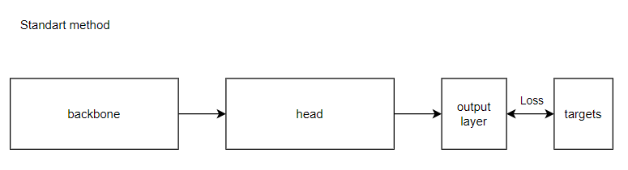
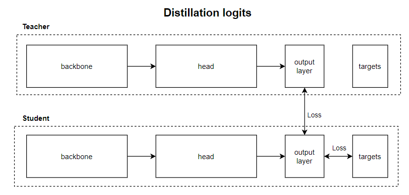
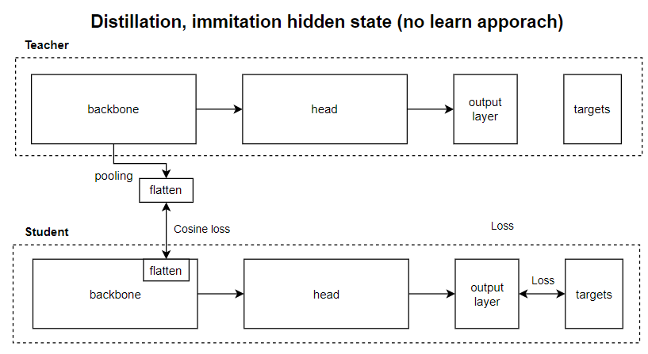
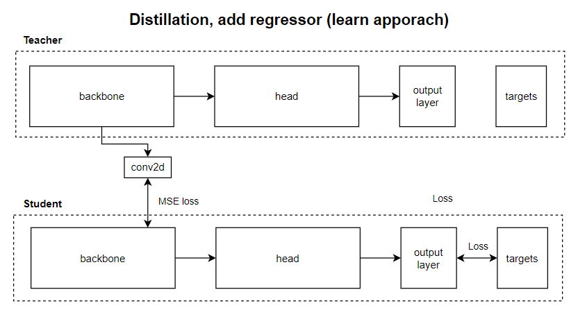
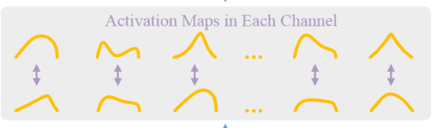

# Разные виды дистилляции

## Задание

В ходе домашнего задания попробуем разные виды дистилляции и их комбинации.

## Датасет

Предлагается взять [CIFAR 10](https://paperswithcode.com/dataset/cifar-10), так как необходимо будет держать в памяти две архитектуры параллельно.

## Пререквизит
1. Обучить архитектуру, которая далее будет считаться Учителем.
2. Обучить архитектуру, которая далее будет считаться Студентом. Архитектура должна быть слабее Учителя.
3. Сравнить метрики.

## Эксперимент 1 - Дистилляция логитов
1. Измените тренировочный цикл так, чтобы параллельно в две архитектуры подавались семплы, при этом в Учителе должно быть отколючено обновление градиентов (torch.no_grad()).
2. Изменить функцию ошибки.

## Эксперимент 2 - Учим Студента совпадать по скрытому состоянию с Учителем (без модификации и обучения архитектур)
1. Привести какие-либо блоки скрытого пространства Учителя и Студента к одной размерности.
2. Добавить в целевую функцию ошибки cosine loss между фичами Студента и Учителя.

## Эксперимент 3 - Добавляем обучаемый регрессор
1. Добавить в архитектуру новый блок, который может обучаться (conv2d).
2. Добавить в целевую функцию ошибки MSE loss между фичами Студента и Учителя.

## Эксперимент бонус - Комбинированный лосс
1. Попробуйте что-то, чего не было в ДЗ, например, скомбинируйте несколько дистилляций.
2. Попробуйте имитировать активацию фичмап.
3. Попробуйте N блоков Учителя на N-1 блок Студента.

